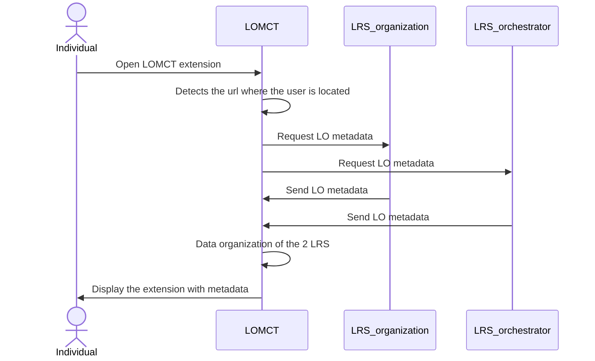
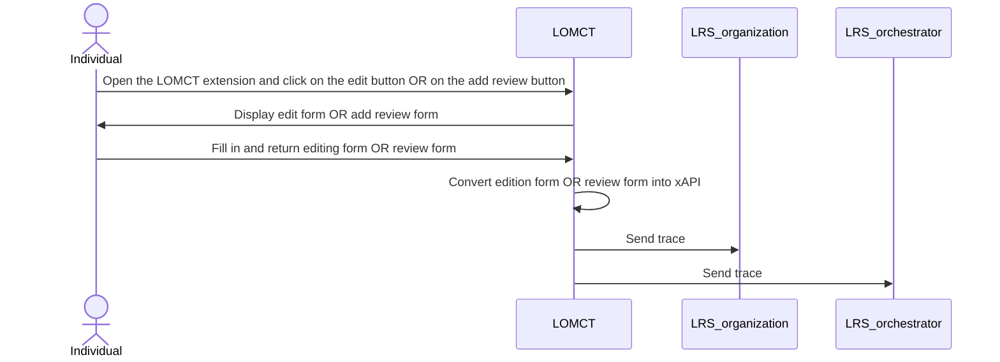

# Learning Object Metadata Crowd Tagging BB 

Learning Object Metadata Crowd Tagging is a system for tagging and reviewing learning objects such as videos, courses, and documents using a crowd of individuals. The goal is to make these learning objects more discoverable and searchable by adding relevant keywords, descriptions, reviews and other useful metadata. This process is carried out via the combination of a browser (Chrome) extension and a Learning Record Store (LRS) that allows multiple users to submit review and metadata edit proposals of learning objects. All the reviews and metadata edit proposals are sent in xAPI format and stored in an LRS to ensure data interoperability.

## Design Document
See the design document [here](docs/design-document.md).

## LOMCT extension Installation Guide

### Prerequisites

Before installing the LOMCT extension, ensure you have:

- Chrome browser
- A Learning Record Store (LRS) endpoint URL
- A basic auth url for your LRS

### Running instructions

1. Download the latest release
2. Get into developer mode with Chrome extension management
3. Click on 'Load Unpacked'
4. Select the `src` folder
5. You can pin the extension (or not)

### Configuration
1. Open the extension and fill in the required fields:
    - username
    - e-mail address
    - biography (this can be your job or profession)
    - endpoint of your LRS
    - basic auth of you LRS
2. Add a secondary source managed by Inokufu (content shared in Prometheus-X and moderated)
    - Navigate to `options` of the extension
    - Activate the secondary source
    - Configure the secondary source link : https://lrs.dataspace.inokufu.com/data/xAPI
    - Configure the secondary source basic auth : NzkxMjlhNzRmNjUyZmI0NmU0NTA5Y2Y5MTdkMmY0ZWU1YjkxYjZkYTo4YWU0MGNhNjJjMmM4NTE4YzZjMzAwZDBhNGI4OTE4YTI0M2I1YjRl 

## Usage
As the LOMCT extension is not an API, there is no endpoint for use.
Once installed and configured, the LOMCT extension works in total autonomy.
An individual can consult the reviews and metadata of any resource.

An individual can add a review or an metadata edit proposal to any resource.

## Unit testing
### Setup test environment
### Run tests
### Expected results

## Component-level testing
### Setup test environment
### Run tests
### Expected results
