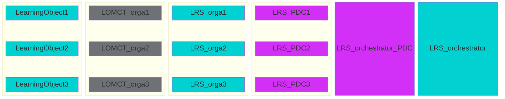
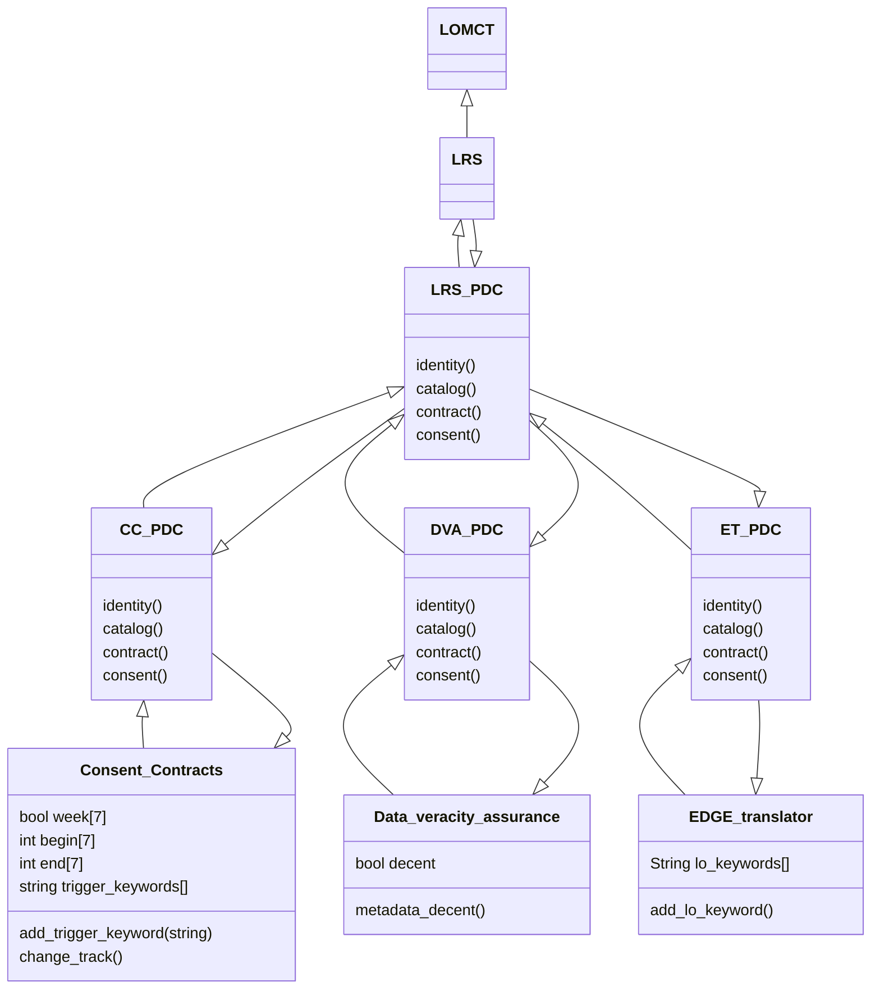
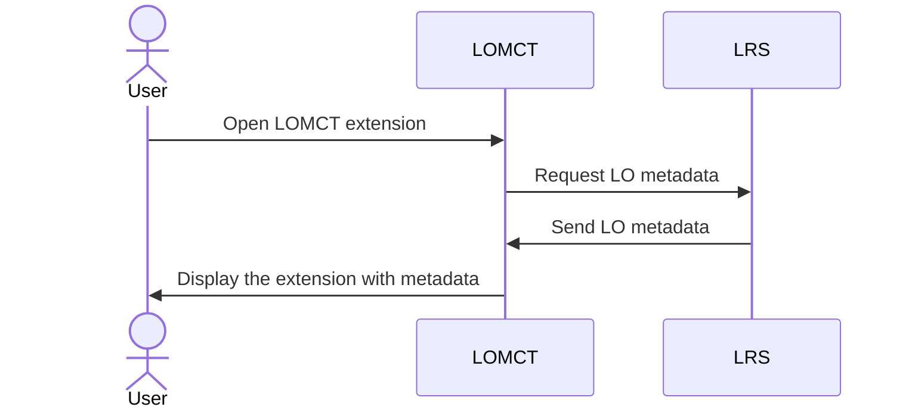
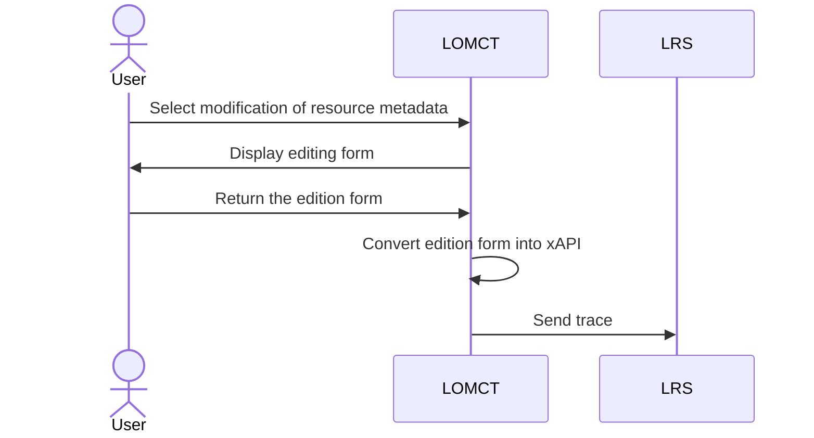

# Learning Object Metadata Crowd Tagging (LOMCT) BB – Design Document

Learning Object Metadata Crowd Tagging is a method for tagging and reviewing digital learning resources such as videos, courses, and documents using a crowd of individuals. The goal is to make these resources more discoverable and searchable by adding relevant keywords, descriptions, reviews and other useful metadata. This process is carried out via the combination of a browser (Chrome) extension and a Learning Record Store (LRS) that allows multiple users to submit review and metadata edit proposal of learning resources. All the reviews and metadata edit proposals are sent in xAPI format and stored in a LRS.

The LOMCT is a data service (browser extension) which facilitates the collection of feedback from teachers about LO (metadata, reviews). The LO index is a data source (LRS) for organizations which want to store metadata and reviews of LO submitted by their teachers or course designers.

Please note that the following visuals are intended as projections only. UX/UI work will be carried out later in the process.


## Technical usage scenarios & Features

**Key functionalities:**

- Submit metadata edit proposal for a Learning object (LO) by an individual

- Write a review for a LO by an individual

- Visualize all metadata edit proposals and reviews associated to a LO

**Value-added:**

- highlight good learning objects

- better metadata quality of learning objects

- ability to freely review learning object

### Features/main functionalities

**Features**: 

The LOMCT interacts with one or more Learning Records Stores. This LRS is deployed by an organization. Each organization will have its own metadata ecosystem, which can be shared at business model level in the dataspace. Data sent from the LOMCT to the LRS belongs to the organization holding the LRS. This implies :
- The organization gives access to its LRS to the desired individuals.
- Anyone with the LRS “source link” and “source basic auth” can post and view LRS metadata.
- LOMCT does not manage the validation of edit proposals and reviews. Everything is sent to the targeted LRS with no particular status.
- The organization must moderate edit proposals and reviews of its LRS. LOMCT does not offer this service.

The Inokufu organization will offer an additional metadata moderation service.

- **Submit metadata edit proposal of a Learning object (LO) by an individual** \
Each Learning Object (video, article, podcast, …) is described by metadata: title, description, category, type, level, etc. Sometimes the metadata is wrong or missing. With LOMCT, each user can submit a metadata edit proposal. Once the proposal has been sent, the individual cannot edit it. The only way to modify/delete this metadata is via the LRS, by the LRS holder.\
	Path: \
		- "The individual is confronted with a resource that has few or incorrect metadata" \
		- "The individual opens the LOMCT" \
		- "LOMCT asks for the username and bio (job/area of expertise) of the individual" \
		- "Individual enters the url of the LO to edit" \
		- "The individual submits his metadata edit proposal" \
		- "LOMCT send the metadata edit proposal to the LO index (LRS), formatted as xAPI statement"

- **Write a review of a LO by an individual** \
The same Learning Object can be seen as relevant or not depending on the teacher point of view, his targeted learning outcome, his habits, etc. With LOMCT, each user can write his own review of the LO and explain why he finds it relevant or not for his needs. Once the review has been sent, the individual cannot edit it. The only way to modify/delete the review is via the LRS by the LRS owner. On the other hand, if the individual sends a new review, this is the one that will be displayed. This does not overwrite the old review, but renders it obsolete. \
	Path:  \
		- "The individual is confronted with a resource that he wants to add a review" \
		- "The individual opens the LOMCT" \
		- "LOMCT asks for the username and bio (job/area of expertise) of the individual" \
		- "Individual enters the url of the LO to add a review" \
		- "The individual submits his review" \
		- "LOMCT send the review to the LO index (LRS), formatted as xAPI statement"

- **Visualize all metadata edit proposals and reviews associated to a LO** \
Thanks to LOMCT, many metadata edit proposals and reviews will be collected for each LO. All these data are stored as xAPI statements in a LRS. With LOMCT, each user can see all the metadata edit proposals and reviews associated with a LO, made by all others users connected to the same LRS.  \
	Path:  \
		- "Individual enters the url of the LO to edit" \
		- "LOMCT send request to LO index (LRS)" \
		- "LOMCT also shows metadata edit proposals and reviews linked to this LO" \
		- "Authors of the metadata edit proposals and reviews are shown with username and bio (job/area of expertise)"

### Technical usage scenarios

Here is an example of how LOMCT is used by an university professor:

- A university professor is preparing a course on the history of medieval Europe. They have created a number of digital learning resources, including video and documents, to support the course.

- The professor wants to make these resources more discoverable and searchable for students, so they decide to use LOMCT to add them to the university LO index (LRS) with relevant metadata.

- The professor uses an LMS that allows multiple users to contribute and edit a given course.

- Others course contributors use the LOMCT to write reviews about some of the learning objects used in this courses

- The university LO index is connected to a service that uses machine learning algorithms to automatically improve metadata quality of the LO and compute quality indicators for each LO based on the reviews provided by the contributors.

- If the university is connected to other partner universities through the data space of education and skills, the professor can make the metadata of its LO available to other users in the partner universities. This will allow other organizations and individuals to discover and access the learning objects using the relevant keywords and descriptions provided.

Here is an example of how LOMCT is used by an employee of company:

- An employee of a pharmaceutical company would like to consolidate his knowledge of natural medicines.

- The employee searches YouTube for a video on the subject.

- He finds a video interesting and would like to hear what other people think.

- He opens LOMCT, looks at the comments and realizes that the resource is rated 4 out of 5 stars with 42 reviews. The overall opinion is that the resource is for beginners.

- Then he goes to the information tab in the LOMCT where he sees that the resource is rated as "expert".

- He proposes changing this metadata to "novice". This way, people looking for an easy resource will find this video.

## Requirements

| Requirement ID | Short description | BB input format | BB output format | Any other constraints | Verified by scenario | Requirement type |
|---|---|---|---|---|---|---|
| BB-REQ_ID__1 | LOMCT must request the consent of collect data | | |  |  |  |
| BB-REQ_ID__1.1 | Individuals must consent to the use of their data in LOMCT : mail, username and biography| chek box | chek box | If the answer is no, the user has no access to the extension | BB-SC-LOMCT-01 | DEP |
| BB-REQ_ID__1.2 | Consent must be asked and verified in less than 30s |  | |  | BB-SC-LOMCT-02 | PERF |
| BB-REQ_ID__2 | LOMCT should connect with BB Data veracity assurance (EDGE-Skill) | API call | API response |  |  |  |
| BB-REQ_ID__2.1 | BB Data veracity assurance should check dataset is decent | xAPI (DASES) dataset | response |  | Not for the first version | FUN |
| BB-REQ_ID__3 | LOMCT should connect with BB EDGE translator (EDGE-Skill) |  |  |  |  |  |
| BB-REQ_ID__3.1 | expand the keywords of LOs | call API | xAPI |  |  Not for the first version  | FUN |
| BB-REQ_ID__3.2 | Exchange must be under 30s | API call | API response |  |  Not for the first version  | PERF |

## Integrations

### Direct Integrations with Other BBs

**Interact with Edge translators**
*Not for the first version*

How?

- called to identify keyword terminology

- asynchronous

- xAPI format

Why?

- ensure a more efficient search thanks to numerous keywords

**Interact with Edge computing - AI training**
*Not for the first version*

How?

- send anonymized (or not) data to train AI models

Why?

- train AI model

**Interact with Data veracity assurance**
*Not for the first version*
How?

- send access to LRS

Why?

- to ensure that data exploitation is feasible

- ensure data consistency

- ensure data is decent


## Relevant Standards

### Data Format Standards

**Data format:**

- the data produced and/or consumed are learning records. These are logs of learning activity done by a user.

- There are several standard formats for learning records (SCORM, xAPI, cmi5, IMS caliper).

- The consensus among experts is that xAPI is the most promising standard for describing learning records.

- Inokufu have published on Prometheus-X's github a state of the art study about learning records interoperability in 2023 (see [here](https://github.com/Prometheus-X-association/learning-records-interoperability-2023)). This study describes the various formats and explains why “we" have selected xAPI as the defacto format for learning records for DASES (Dataspace of Education & Skills).

- In xAPI, each learning record is a json statement. This json contains several parts: actor, verb, object, result, context, timestamp.

- The most critical personal data are in general in the actor part. According to xAPI, one can use first name, last name or email as the actor identifier. However, in our case we always recommend using uuid to identify actors. This way our learning records are pseudonymized by default. As this won’t always be the case with other organizations connected to the dataspace.

- If shared datasets are not in xAPI format, LRC must be used to convert them to the correct format.

### Mapping to Data Space Reference Architecture Models


PDC : Prometheus-X Dataspace Connector

Each organization will generate metadata in its LRS, then send it to the LRS orchestrator for exchange in dataspace.

## Input / Output Data

Input and output data are in the same format: xAPI.

**Example 1: Review**

A user want to write a review about this video:

 [https://www.youtube.com/watch?v=hLE-5ElGlPM](https://www.youtube.com/watch?v=hLE-5ElGlPM)

His review is:

- he rates this video 5/5

- he writes the following comment: “Fantastic video for every history student in the Bachelor of Medieval History.”

Here is the corresponding xAPI statement:


```json

{

"statement": {

"authority": {

"objectType": "Agent",

"name": "University A LOMCT",

"mbox": "mailto:contact@universitya.com"

},

"stored": "2024-03-11T14:17:43.686Z",

"context": {

"contextActivities": {

"parent": [

{

"id": "https://universitya.com/home",

"objectType": "Activity"

}

],

"category": [

{

"id": "https://w3id.org/xapi/dod-isd/verbs/categories/history",

"objectType": "Activity"

}

]

},

"language": "en"

},

"actor": {

"account": {

"homePage": "https://universitya.com/users",

"name": "123456789"

},

"objectType": "Agent"

},

"timestamp": "2024-03-11T14:17:32.814Z",

"version": "1.0.0",

"id": "8f5e30f6-312e-4ec6-bc60-a37bcb1811ec",

"verb": {

"id": "http://id.tincanapi.com/verb/reviewed",

"display": {

"en-US": "reviewed"

}

},

"object": {

"id": "https://www.youtube.com/watch?v=hLE-5ElGlPM",

"definition": {

"name": {

"en": "What is History for?"

},

"description": {

"en": "The fundamentals about History and why we need it."

},

"type": "http://activitystrea.ms/schema/1.0/video"

},

"objectType": "Activity"

},

"result": {

"score": {

"scaled": 1.0, // Representing a 5/5 score

"raw": 5,

"min": 0,

"max": 5

},

"response": "Fantastic video for every history student in the Bachelor of Medieval History."

}

}

}

```

**Example 2: Metadata Edit Proposal**

A user want to propose metadata edit about this video:

 [https://www.youtube.com/watch?v=hLE-5ElGlPM](https://www.youtube.com/watch?v=hLE-5ElGlPM)

His proposals are:

- this video is associated to the verb discover according to bloom taxonomy

- the provider of this video is Youtube

Here is the corresponding xAPI statement:


```json

{

"statement": {

"authority": {

"objectType": "Agent",

"name": "University A LOMCT",

"mbox": "mailto:contact@universitya.com"

},

"stored": "2024-03-11T14:17:43.686Z",

"context": {

"extensions": {

"http://id.tincanapi.com/extension/bloom": "discover",

"http://id.tincanapi.com/extension/provider": "YouTube"

},

"contextActivities": {

"parent": [

{

"id": "https://universitya.com/home",

"objectType": "Activity"

}

],

"category": [

{

"id": "https://w3id.org/xapi/dod-isd/verbs/categories/history",

"objectType": "Activity"

}

]

},

"language": "en"

},

"actor": {

"account": {

"homePage": "https://universitya.com/users",

"name": "123456789"

},

"objectType": "Agent"

},

"timestamp": "2024-03-11T14:17:32.814Z",

"version": "1.0.0",

"id": "8f5e30f6-312e-4ec6-bc60-a37bcb1811ec",

"verb": {

"id": "https://w3id.org/xapi/dod-isd/verbs/proposed",

"display": {

"en-US": "proposed"

}

},

"object": {

"id": "https://www.youtube.com/watch?v=hLE-5ElGlPM",

"definition": {

"name": {

"en": "What is History for?"

},

"description": {

"en": "The fundamentals about History and why we need it."

},

"type": "http://activitystrea.ms/schema/1.0/video"

},

"objectType": "Activity"

}

}

}

```

## Architecture

PDC : Prometheus-X Dataspace Connector


Dynamic Behaviour
Behavior to display a resource :

PDC : Prometheus-X Dataspace Connector

Behavior to edit the metadata of a resource (the identification, consent and contract steps have already been completed when the extension is displayed) :


## Configuration and deployment settings

**Deployment and installation:**

- install a LRS

- install LOMCT browser extension (available on Chrome first)
  
**Configuration**

- Enter the URL(s) of the LRS in the LOMCT settings.
- Enter the user credentials in the LOMCT settings.


## Error scenarios defined

The idea of the risk table is to define the probable causes of failure in order to estimate the probability of encountering this failure, to evaluate its secondary effects and therefore to plan preventive or corrective actions.

We will assign 3 scores on a scale of 1 to 10 to potential failures:
- detection (risk of non-detection)
- occurrence (probable occurrence, frequency of occurrence)
- severity of effect (consequences for the customer)

Criticality is calculated as follows:
`criticality = detection x occurrence x severity`

If criticality is greater than 10, then preventive action must be taken. If not, no.
| ID  | Function involved                                                                                     | Description of risk                                             | Effect of failure                                                                                       | Cause of failure                                                                                      | Evaluation - Detection | Evaluation - Occurrence | Evaluation - Severity | Evaluation - Criticality | Preventive actions                                                                                                                                                                    |
| --- | ------------------------------------------------------------------------------------------------------ | --------------------------------------------------------------- | ------------------------------------------------------------------------------------------------------ | ---------------------------------------------------------------------------------------------------- | ---------------------- | ----------------------- | --------------------- | ------------------------ | -------------------------------------------------------------------------------------------------------------------------------------------------------------------------------------- |
| 1   | Submit metadata edit proposal and write a review of a Learning object (LO) by an individual           | Data may be lost during migration                              | The organization doesn't receive the complete statements about the reviews or the metadata edit proposals. | Incorrect connection between LOMCT and LRS                                                            | 2                      | 2                       | 7                     | 28                       | Set up recurring connection tests                                                                                                                                                      |
| 3   |                                                                                                        | Data could be transmitted to other non-targeted LRSs           | Exported data may be accessible to unauthorized persons                                                 | They are not properly secured                                                                         | 6                      | 1                       | 9                     | 54                       | Set up recurring connection tests<br>Test the cloud service's scalability                                                                                                             |
| 4   |                                                                                                        | The LRS doesn't have enough storage space for all statements    | No more statement import                                                                               | Too little storage                                                                                  | 1                      | 3                       | 9                     | 24                       | Test the cloud service's scalability<br>Can be connected to BB Data veracity assurance (EDGE-Skill)                                                                                 |
| 5   |                                                                                                        | The system may require downtime for large imports/exports       | Disrupting normal operations                                                                           | Low-performance servers                                                                             | 1                      | 3                       | 4                     | 12                       | Test the cloud service's scalability<br>Send statement to various LRS                                                                                                               |
| 6   |                                                                                                        | User posts vulgar or insulting words                            | Unnecessary comment                                                                                    | Space for expression                                                                                | 1                      | 2                       | 6                     | 12                       | Can be connected to BB Data veracity assurance (EDGE-Skill)                                                                                                                          |
| 7   |                                                                                                        | The user is linked to several schools                          | Connection required with several LRS                                                                   | Implementation                                                                                      | 3                      | 5                       | 2                     | 10                       | Send statement to various LRS                                                                                                                                                        |
| 8   |                                                                                                        | Personal information is sent to LRS                             | Non-compliance with RGPD                                                                               | Implementation                                                                                      | 4                      | 2                       | 9                     | 54                       | All these data are stored locally in the user browser/desktop.                                                                                                                                                                                     |
| 9   | **Visualize all metadata edit proposals and reviews associated to a LO**                              | The user proposes a false edition                               | False metadata                                                                                         | Space for expression                                                                                | 1                      | 3                       | 7                     | 84                       | A unique user id is used to distinguish users contributions from the admin statements, seen as the truth.                                                                                                                                                                  |
| 10  |                                                                                                        | Metadatas don't update                                          | Poor visualization of the metadata                                                                     | Slow update due to servers                                                                           | 4                      | 3                       | 8                     | 16                       | The data proposed by the user is not posted as truthful but in a space that states that it is an editing proposal                                                                                                                                  |
| 11  |                                                                                                        | Inadequate user interface                                       | No use of the platform                                                                                 | UI design is misleading                                                                              | 4                      | 9                       | 8                     | 96                       | Optimize extension                                                                                                                                                                   |
| 12  |                                                                                                        | Wrong design choices: colors, shapes, ...                        | No use of the platform                                                                                 | Visual choices such as colors and graphics can subliminally influence the perception of data. Graphs are non-inclusive | 1                      | 7                       | 5                     | 96                       | Conduct pre-development workshops to ascertain user requirements                                                                                                                                                                                  |
| 13  |                                                                                                        | Identical statements in the same or several LRS                  | Duplicated information                                                                                 | Several sources of LRS                                                                               | 1                      | 7                       | 5                     | 45                       | Conduct pre-development workshops to ascertain user requirements and use accessibility tools                                                                                                                                                      |
| 14  |                                                                                                        | The user is linked to several organizations                     | Too much information on the front page, information conflict                                           | Implementation                                                                                      | 1                      | 7                       | 5                     | 35                       | Only the most recent statement from the primary LRS is visible.                                                                                                                                                                                   |
| 15  |                                                                                                        | Several reviews from the same author are detected                | Obsolete reviews visible                                                                               | Implementation                                                                                      | 2                      | 7                       | 6                     | 35                       | All statements are displayed chronologically                                                                                                                                                                                                       |
| 16  |                                                                                                        | Several metadata edit proposal from the same author are detected (simple user) | Metadata in several statements                                                                   | Implementation                                                                                      | 2                      | 7                       | 6                     | 84                       | Display the organization's most recent statement and ignore the others                                                                                                                                                                             |
| 17  | **Submit metadata edit proposal and write a review of a Learning object (LO) by the organization**    | The organization may decide to change its LRS                   | Complication in determining the source of truth                                                         | Change of LRS                                                                                        | 1                      | 2                       | 1                     | 2                        |                                                                                                                                                                                        |
| 18  |                                                                                                        | The organization's statements are not differentiated from others | Reconnecting the LOMCT and the new LRS                                                                | Implementation                                                                                      | 5                      | 5                       | 5                     | 125                      | Detect when username = authority.name it is organization.                                                                                                                                                                                         |
| 19  | Other                                                                                                  | Content Fragmentation                                           | No valorization of the organization's statements                                                        | The same LO is available on multiple sites and platforms with different URLs.                         | 1                      | 7                       | 5                     | 35                       | Assign a Global Unique Identifier (GUID) to each LO.                                                                                                                                                                                               |


## Third Party Components & Licenses

External components and licenses:

- chromium-based web browser extension V3, [open source](https://github.com/SimGus/chrome-extension-v3-starter), [license MIT](https://github.com/SimGus/chrome-extension-v3-starter?tab=MIT-1-ov-file#readme)


## OpenAPI Specification

*In the future: link your OpenAPI spec here.*


```yml

openapi: 3.0.0 \
info: \
     version: 0.0.1 \
     title: Learning object metadata crowd tagging \
   description: Learning Object Metadata Crowd Tagging is a service to easily review or tag digital learning resources such as videos, presentations, and documents by a crowd of individuals. The goal is to make these resources more discoverable and searchable by adding/changing relevant keywords, descriptions, and other metadata or by attaching them a review. Users interacts with this service using a browser extension. \
paths: \
     /list: \
          get: \
               description: Returns a list of stuff \
                    responses: \
                         '200': \
                              description: Successful response


```

## Codebase : Mockup version
To get a functional understanding of this mockup and see some sample traces, go here : https://github.com/Prometheus-X-association/lomct/blob/main/docs/Images/LOMCT%20-%20Mock%20up%20.pdf

To have a write access to the traces make a request on this mockup document : https://docs.google.com/document/d/15sV1DR43r0GAP8EV8HmT0b-k0m4glPzQUwgn95XYrSQ/edit
To have a read access to the traces make a request on this mockup document: https://docs.google.com/document/d/1qqDXDdfBkC5TJS1AgR7Wh72-h3mchLmyboX0hOquAZM/edit
To have all access to the traces make a request on this mockup document : https://docs.google.com/document/d/1Yp6LGh18bzp5Vbj4KiwYLZnBhedBAevjNxp07ao-HM8/edit

The LOMCT code does not include any APIs. In fact, data exchange is generated by the user's action (sending a review/proposal and get  metadata). This data is stored in a third-party LRS, which itself has an API. In our case, we are using the LRS learning locker. API calls are generic to all LRS.

### PUT
description: Store a single statement as a single member of a set.

### POST
description: "Store a set of statements (or a single statement as a single member of a set).

### GET
description: Read a single xAPI Statement or multiple xAPI Statements.

[Answer API of Learning Locker](https://learninglocker.atlassian.net/wiki/spaces/DOCS/pages/106463240/Rest+API)

# Test specification

The Learning Object Metadata Crowd Tagging tests ensure that:
- functionality is efficient
- potential risks are under control
- users are satisfied

## Test plan

The LOMCT testing strategy will focus on ensuring the accuracy, reliability, and performance of its functionality. We will use a combination of unit testing, integration testing, and user interface testing. The test environment will reproduce conditions similar to those in production in order to accurately validate BB behavior. Acceptance criteria will be defined based on user stories, functional requirements, and performance criteria.

## Methodology

We will run manual tests.

### Validate requirements
Requirements validation tests

| Verified by scenario| Description of requirement | Test | Status |
|---|---|---|---|
| BB-SC-LOMCT-01 | Individuals must consent to the use of their data in LOMCT : mail, username and biography| When creating an account, try to validate the account without validating the check box |  Validated : It is not possible to access the LOMCT without consenting to the sharing of its data |
| BB-SC-LOMCT-02 | Consent must be asked and verified in less than 30s | LOMCT checks whether the person has an active consent checkbox  | Validated |

### Manual Scenario

Using the personas, user stories, user flow, and data flow from the Wiki LOM use case, we established several test scenarios.

#### Persona 1: mmegauss (1 LRS)
**First time install with 1 LRS**
- Onboarding:
  - Enter username: "mmegauss"
  - Write bio: "Professeur de linguistique au M2 Sciences Po Paris"
  - Connect one LRS: "https://XXX.com/data/xAPI"
  - Accept the checkbox for visibility of username and biography.

**Validation:**
- Account creation with locally stored information.

#### Persona 2: mcgonagall (2 LRS)
**First time install with 2 LRSs**
- Onboarding:
  - Enter username: "mcgonagall"
  - Write bio: "Management professor at Cambridge University"
  - Connect primary LRS: "https://XXX.com/data/xAPIx"
  - Accept the checkbox for visibility of username and biography.
  - Continue to settings extension page.
  - Connect secondary LRS: "https://XXX2.com/data/xAPIx"

**Validation:**
- Account creation with locally stored information.

#### Persona 3: the authority
**First install of authority**
- Onboarding:
  - Enter username: "French School Business"
  - Write bio: "French School Business: Lyon"
  - Connect primary LRS: "https://XXX.com/data/xAPIx"
  - Accept the checkbox for visibility of username and biography.

**Validation:**
- Account creation with locally stored information.

### Test scenarios

#### Test scenario 1

**mmegauss (persona 1) writes a review:**
- Learning Object: [https://www.youtube.com/watch?v=hLE-5ElGlPM](https://www.youtube.com/watch?v=hLE-5ElGlPM)
- Review:
  - Rating: 5/5
  - Comment: “Fantastic video for every history student in the Bachelor of Medieval History.”

**Validation:**
- Statement visible on connected LRS.
- Review displayed in the reviews section.

#### Test scenario 2

**mmegauss (persona 1) writes a review:**
- Learning Object: [https://en.wikipedia.org/wiki/Technology_readiness_level](https://en.wikipedia.org/wiki/Technology_readiness_level)
- Review:
  - Rating: 2/5
  - Comment: “The level is subjective.”

**Validation:**
- Statement visible on connected LRS.
- Review displayed in the reviews section of the correct learning object.

#### Test scenario 3

**mcgonagall (persona 2) writes a review:**
- Learning Object: [https://www.youtube.com/watch?v=daM8YfBTNAg](https://www.youtube.com/watch?v=daM8YfBTNAg)
- Review:
  - Rating: 4/5
  - Comment: “Good podcast to understand the Second World War.”

**Validation:**
- Statement visible on both connected LRSs.
- Review displayed only once in the reviews list.

#### Test scenario 4

**mmegauss (persona 1) submits a metadata edit proposal:**
- Learning Object: [https://www.youtube.com/watch?v=daM8YfBTNAg](https://www.youtube.com/watch?v=daM8YfBTNAg)
- Proposal:
  - Change type to podcast.
  - Title: History through time
  - License: [https://www.gnu.org/licenses/quick-guide-gplv3.en.html](https://www.gnu.org/licenses/quick-guide-gplv3.en.html)
  - Provider: Youtube

**Validation:**
- Proposal visible on LRS.
- Displayed in "Suggested Edits" section in the "information" extension.

#### Test scenario 5

**mmegauss (persona 1) submits a metadata edit proposal:**
- Learning Object: [https://en.wikipedia.org/wiki/Pythagorean_theorem](https://en.wikipedia.org/wiki/Pythagorean_theorem)
- Proposal:
  - Change type to article.
  - Title: Pythagorean theorem
  - Provider: Wikipedia
  - Bloom: discover

**Validation:**
- Proposal visible on LRS.
- Displayed in "Suggested Edits" sections in "Home" and "information" extensions.

#### Test scenario 6

**mcgonagall (persona 2) submits a metadata proposal:**
- Learning Object: Quelle différence entre l'anglais américain et britannique ? Quel accent choisir : UK ou US ?
- Proposal:
  - Type: Video
  - Bloom: understand
  - Title: Quelle différence entre l'anglais américain et britannique ? Quel accent choisir : UK ou US ?
  - Provider: Youtube
  - Language: French
  - Keywords: 'BritishVsAmerican'

**Validation:**
- Proposal visible on both connected LRSs.
- Displayed only once in "Suggested Edits" section in "information" extension.

#### Test scenario 7

**The authority (Persona 3) submits metadata edit proposals:**
- Learning Object: What caused the French Revolution? - Tom Mullaney
- Proposals:
  1. Type: Podcast
     - Bloom: describe compare
     - Level: expert
     - Title: History through time
     - License: [https://www.gnu.org/licenses/quick-guide-gplv3.en.html](https://www.gnu.org/licenses/quick-guide-gplv3.en.html)
     - Provider: Youtube
     - Language: English
     - Duration: 5:38 minutes
     - Author: Tom Mullaney

  2. Type: Video
     - Title: what caused the French Revolution?
     - Level: novice
     - Provider: Youtube
     - Language: English

**Validation:**
- Statements visible on authority's LRS.
- Only the statement published on March 5 displayed in "information" section.

#### Test scenario 8

**mmegauss (persona 1) writes a review on a previously reviewed learning object:**
- Learning Object: Langage Langue Parole (selon De Saussure) - Ma Langue dans Ta Poche #1
- Previous review:
  - Date: 07-12-2017
  - Rating: 3/5
  - Comment: “La vidéo n'est pas pertinente par rapport à l'ouvrage de l'auteur.”
- Subsequent review:
  - Date: 04-05-2020
  - Rating: 4/5
  - Comment: “C'est une vidéo dynamique pour introduire la pensée de Saussure aux étudiants de licence.”

**Validation:**
- Both statements visible on LRS.
- Only the newest review displayed in reviews list.

#### Test scenario 9

**mcgonagall (persona 2) writes a review on a previously reviewed learning object:**
- Learning Object: [https://hbr.org/2016/05/embracing-agile](https://hbr.org/2016/05/embracing-agile)
- Previous review:
  - Date: 01-04-2022
  - Rating: 5/5
  - Comment: “Interesting Article for Educational Use with First-Year College Students”
- Subsequent review:
  - Date: 06-07-2023
  - Rating: 4/5
  - Comment: “The article is still useful, but it needs an update.”

**Validation:**
- All statements visible on both connected LRSs.
- Only the newest review displayed in the reviews list.

#### Test scenario 10

**mmegauss (persona 1) submits several metadata edit proposals:**
- Learning Object: [https://en.wikipedia.org/wiki/President_of_the_United_States](https://en.wikipedia.org/wiki/President_of_the_United_States)
- Proposals:
  1. Change type to podcast.
     - Title: President
     - Provider: Youtube

  2. Type: article
     - Title: President of the united States
     - Provider: Wikipedia

**Validation:**
- Both statements visible on LRS.
- Displayed in "Suggested edits" section chronologically.


### UI test (where relevant)

Please note that the following visuals are intended as projections only. UX/UI work will be carried out later in the process.


## Partners & roles
[Inokufu](https://www.inokufu.com/) (BB leader): 
- Organize workshops
- Monitor partner progress
- Develop backend of LOMCT
- Develop frontend of LOMCT

[edtake](https://www.edtake.com/)
- test the extension

## Usage in the dataspace
The LOMCT will be used as a potential source of data for a LRS and thus be part of the service chains:

- Personal learning record: Sharing LMS/Moodle Data for Visualization

  
.png)
PDC : Prometheus-X Dataspace Connector

- Decentralized AI training: Training of trustworthy AI models
