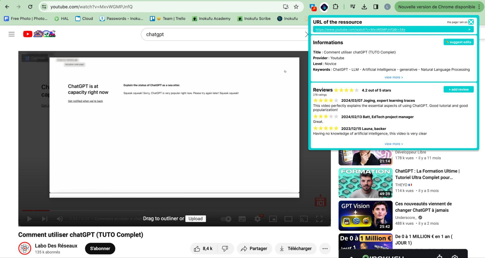
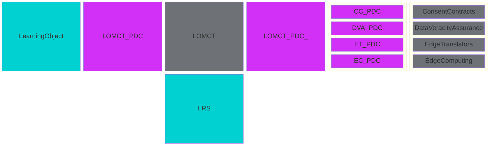
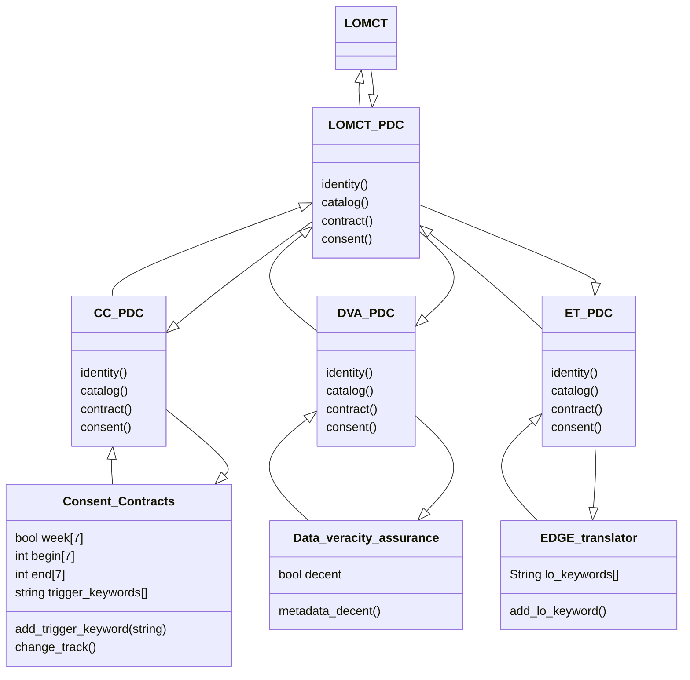
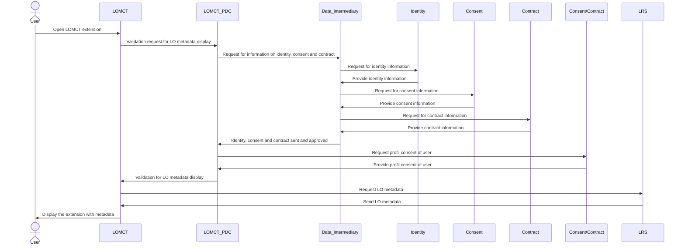
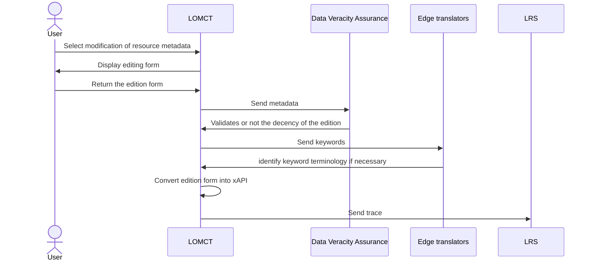

# Learning Object Metadata Crowd Tagging (LOMCT) BB – Design Document

Learning Object Metadata Crowd Tagging is a method for tagging and reviewing digital learning resources such as videos, courses, and documents using a crowd of individuals. The goal is to make these resources more discoverable and searchable by adding relevant keywords, descriptions, reviews and other useful metadata. This process is carried out via the combination of a browser (Chrome) extension and a Learning Record Store (LRS) that allows multiple users to submit review and metadata edit proposal of learning resources. All the reviews and metadata edit proposals are sent in xAPI format and stored in a LRS.

The LOMCT is a data service (browser extension) which facilitates the collection of feedback from teachers about LO (metadata, reviews). The LO index is a data source (LRS) for organizations which want to store metadata and reviews of LO submitted by their teachers or course designers.

Please note that the following visuals are intended as projections only. UX/UI work will be carried out later in the process.


## Technical usage scenarios & Features

**Key functionalities:**

- Submit metadata edit proposal for a Learning object (LO) by an individual

- Write a review for a LO by an individual

- Visualize all metadata edit proposals and reviews associated to a LO

**Value-added:**

- highlight good learning objects

- better metadata quality of learning objects

- ability to freely review learning object

### Features/main functionalities

**Features**: 

- Submit metadata edit proposal of a Learning object (LO) by an individual \
Each Learning Object (video, article, podcast, …) is described by metadata: title, description, category, type, level, etc. Sometimes the metadata is wrong or missing. With LOMCT, each user can submit a metadata edit proposal. \
	Path: \
		- "The individual is confronted with a resource that has few or incorrect metadata" \
		- "The individual opens the LOMCT" \
		- "LOMCT asks for the username and bio (job/area of expertise) of the individual" \
		- "Individual enters the url of the LO to edit" \
		- "The individual submits his metadata edit proposal" \
		- "LOMCT send the metadata edit proposal to the LO index (LRS), formatted as xAPI statement"

- Write a review of a LO by an individual \
The same Learning Object can be seen as relevant or not depending on the teacher point of view, his targeted learning outcome, his habits, etc. With LOMCT, each user can write his own review of the LO and explain why he finds it relevant or not for his needs.  \
	Path:  \
		- "The individual is confronted with a resource that he wants to add a review" \
		- "The individual opens the LOMCT" \
		- "LOMCT asks for the username and bio (job/area of expertise) of the individual" \
		- "Individual enters the url of the LO to add a review" \
		- "The individual submits his review" \
		- "LOMCT send the review to the LO index (LRS), formatted as xAPI statement"

- Visualize all metadata edit proposals and reviews associated to a LO \
Thanks to LOMCT, many metadata edit proposals and reviews will be collected for each LO. All these data are stored as xAPI statements in a LRS. With LOMCT, each user can see all the metadata edit proposals and reviews associated with a LO, made by all others users connected to the same LRS.  \
	Path:  \
		- "Individual enters the url of the LO to edit" \
		- "LOMCT send request to LO index (LRS)" \
		- "LOMCT also shows edit proposals and reviews linked to this LO" \
		- "Authors of the metadata edit proposals and reviews are shown with username and bio (job/area of expertise)"

### Technical usage scenarios

Here is an example of how LOMCT is used by an university professor:

- A university professor is preparing a course on the history of medieval Europe. They have created a number of digital learning resources, including video and documents, to support the course.

- The professor wants to make these resources more discoverable and searchable for students, so they decide to use LOMCT to add them to the university LO index (LRS) with relevant metadata.

- The professor uses an LMS that allows multiple users to contribute and edit a given course.

- Others course contributors use the LOMCT to write reviews about some of the learning objects used in this courses

- The university LO index is connected to a service that uses machine learning algorithms to automatically improve metadata quality of the LO and compute quality indicators for each LO based on the reviews provided by the contributors.

- If the university is connected to other partner universities through the data space of education and skills, the professor can make the metadata of its LO available to other users in the partner universities. This will allow other organizations and individuals to discover and access the learning objects using the relevant keywords and descriptions provided.

Here is an example of how LOMCT is used by an employee of company:

- An employee of a pharmaceutical company would like to consolidate his knowledge of natural medicines.

- The employee searches YouTube for a video on the subject.

- He finds a video interesting and would like to hear what other people think.

- He opens LOMCT, looks at the comments and realizes that the resource is rated 4 out of 5 stars with 42 reviews. The overall opinion is that the resource is for beginners.

- Then he goes to the information tab in the LOMCT where he sees that the resource is rated as "expert".

- He proposes changing this metadata to "novice". This way, people looking for an easy resource will find this video.

## Requirements

| Requirement ID | Short description | BB input format | BB output format | Any other constraints | Verified by scenario | Requirement type |
|---|---|---|---|---|---|---|
| BB-REQ_ID__1 | LOMCT must request building block consent via the Prometheus-X Dataspace Connector | API call | API response |  |  |  |
| BB-REQ_ID__1.1 | Individuals must consent to the use of their data in LOMCT | API call | API response | If the answer is no, the data cannot be used, nor transferred into or from the PLRS. If the answer is yer, the data can be used, and transferred into or from the PLRS. | BB-SC-LOMCT-01 | DEP |
| BB-REQ_ID__1.2 | Consent must be asked and verified in less than 30s | API call | API response |  | BB-SC-LOMCT-02 | PERF |
| BB-REQ_ID__2 | LOMCT must request contracts from the building block consent via the Prometheus-X Dataspace Connector | API call | API response |  |  |  |
| BB-REQ_ID__2.1 | The LOMCT must check with the contract manager through the Dataspace connector if a contract for the corresponding organization exists | API call | API response | If the answer is no, the data cannot be accessed, nor transferred into or from the PLRS. If the answer is yer, the data can be accessed, and transferred into or from the PLRS. | BB-SC-LOMCT-03 | DEP |
| BB-REQ_ID__2.2 | Contract must be asked and verified in less than 30s | API call | API response |  | BB-SC-LOMCT-04 | PERF |
| BB-REQ_ID__3 | LOMCT must connect with BB Consent/contracts negotiating agent (EDGE-Skill) |  |  |  |  |  |
| BB-REQ_ID__3.1 | BB must send the individual's consent profile when the LOMCT asks to adjust what and when they are tracked: all-time connection, only on weekends, certain keywords, etc. | API call | consent profile | Request consent 1 time, then update if the profile is modified in the corresponding building bloc. Could be asynchronous | BB-SC-LOMCT-05 | DEP |
| BB-REQ_ID__3.2 | BB must update the individual's consent profile to LOMCT when there are changes | consent profile | / | update if the profile is modified in the corresponding building bloc. Could be asynchronous | BB-SC-LOMCT-06 | DEP |
| BB-REQ_ID__4 | LOMCT should connect with BB Data veracity assurance (EDGE-Skill) | API call | API response |  |  |  |
| BB-REQ_ID__4.1 | BB Data veracity assurance should check dataset is decent | xAPI (DASES) dataset | response |  | BB-SC-LOMCT-06 | FUN |
| BB-REQ_ID__5 | LOMCT should connect with BB EDGE translator (EDGE-Skill) |  |  |  |  |  |
| BB-REQ_ID__5.1 | expand the keywords of LOs | call API | xAPI |  | BB-SC-LOMCT-07 | FUN |
| BB-REQ_ID__5.2 | Exchange must be under 30s | API call | API response |  | BB-SC-LOMCT-08 | PERF |

## Integrations

### Direct Integrations with Other BBs

**Interact with Edge translators**

How?

- called to identify keyword terminology

- asynchronous

- xAPI format

Why?

- ensure a more efficient search thanks to numerous keywords

**Interact with consent/contract**

Why?

- Identify data import period (date, time, week)

- Identify keywords where we can import

- Identify sites where we can import

**Interact with Edge computing - AI processing**

How?

- send anonymized (or not) data to train AI models

Why?

- train AI model

**Interact with Data veracity assurance**

How?

- send access to LRS

Why?

- to ensure that data exploitation is feasible

- ensure data consistency

- ensure data is decent

### Integrations via Connector

**Connection with connector**

Why?

- Simplify communication between the LOMCT and PTX CCs

**Connection with contract** 

Why?

- Contract between LRS supplier and the organization

What?

- Obtain the organization's agreement to export user metadata to the LRS.

- Identify the number of metadata authorized for updating.

- Identify the authorized date range for sending metadata to LRS.

- Agree on data format (xAPI).

**Connection with consent**

Why?

- User consent to export/import his data

What?

- Obtain user consent to export metadata modified/added by him

- Obtain the user's consent to share the metadata with the selected organization

- Obtain consent to share/display metadata with other users

**Connection with identity**

Why?

- Enable LOMCT to use users' identities to display metadata with other

What?

- Use the user's first and last name

- Use the user's professional background

- Use the user's educational background

## Relevant Standards

### Data Format Standards

**Data format:**

- the data produced and/or consumed are learning records. These are logs of learning activity done by a user.

- There are several standard formats for learning records (SCORM, xAPI, cmi5, IMS caliper).

- The consensus among experts is that xAPI is the most promising standard for describing learning records.

- Inokufu have published on Prometheus-X's github a state of the art study about learning records interoperability in 2023 (see [here](https://github.com/Prometheus-X-association/learning-records-interoperability-2023)). This study describes the various formats and explains why “we" have selected xAPI as the defacto format for learning records for DASES (Dataspace of Education & Skills).

- In xAPI, each learning record is a json statement. This json contains several parts: actor, verb, object, result, context, timestamp.

- The most critical personal data are in general in the actor part. According to xAPI, one can use first name, last name or email as the actor identifier. However, in our case we always recommend using uuid to identify actors. This way our learning records are pseudonymized by default. As this won’t always be the case with other organizations connected to the dataspace.

- If shared datasets are not in xAPI format, LRC must be used to convert them to the correct format.

### Mapping to Data Space Reference Architecture Models


PDC : Prometheus-X Dataspace Connector

## Input / Output Data

Input and output data are in the same format: xAPI.

**Example 1: Review**

A user want to write a review about this video:

 [https://www.youtube.com/watch?v=hLE-5ElGlPM](https://www.youtube.com/watch?v=hLE-5ElGlPM)

His review is:

- he rates this video 5/5

- he writes the following comment: “Fantastic video for every history student in the Bachelor of Medieval History.”

Here is the corresponding xAPI statement:


```json

{

"statement": {

"authority": {

"objectType": "Agent",

"name": "University A LOMCT",

"mbox": "mailto:contact@universitya.com"

},

"stored": "2024-03-11T14:17:43.686Z",

"context": {

"contextActivities": {

"parent": [

{

"id": "https://universitya.com/home",

"objectType": "Activity"

}

],

"category": [

{

"id": "https://w3id.org/xapi/dod-isd/verbs/categories/history",

"objectType": "Activity"

}

]

},

"language": "en"

},

"actor": {

"account": {

"homePage": "https://universitya.com/users",

"name": "123456789"

},

"objectType": "Agent"

},

"timestamp": "2024-03-11T14:17:32.814Z",

"version": "1.0.0",

"id": "8f5e30f6-312e-4ec6-bc60-a37bcb1811ec",

"verb": {

"id": "http://id.tincanapi.com/verb/reviewed",

"display": {

"en-US": "reviewed"

}

},

"object": {

"id": "https://www.youtube.com/watch?v=hLE-5ElGlPM",

"definition": {

"name": {

"en": "What is History for?"

},

"description": {

"en": "The fundamentals about History and why we need it."

},

"type": "http://activitystrea.ms/schema/1.0/video"

},

"objectType": "Activity"

},

"result": {

"score": {

"scaled": 1.0, // Representing a 5/5 score

"raw": 5,

"min": 0,

"max": 5

},

"response": "Fantastic video for every history student in the Bachelor of Medieval History."

}

}

}

```

**Example 2: Metadata Edit Proposal**

A user want to propose metadata edit about this video:

 [https://www.youtube.com/watch?v=hLE-5ElGlPM](https://www.youtube.com/watch?v=hLE-5ElGlPM)

His proposals are:

- this video is associated to the verb discover according to bloom taxonomy

- the provider of this video is Youtube

Here is the corresponding xAPI statement:


```json

{

"statement": {

"authority": {

"objectType": "Agent",

"name": "University A LOMCT",

"mbox": "mailto:contact@universitya.com"

},

"stored": "2024-03-11T14:17:43.686Z",

"context": {

"extensions": {

"http://id.tincanapi.com/extension/bloom": "discover",

"http://id.tincanapi.com/extension/provider": "YouTube"

},

"contextActivities": {

"parent": [

{

"id": "https://universitya.com/home",

"objectType": "Activity"

}

],

"category": [

{

"id": "https://w3id.org/xapi/dod-isd/verbs/categories/history",

"objectType": "Activity"

}

]

},

"language": "en"

},

"actor": {

"account": {

"homePage": "https://universitya.com/users",

"name": "123456789"

},

"objectType": "Agent"

},

"timestamp": "2024-03-11T14:17:32.814Z",

"version": "1.0.0",

"id": "8f5e30f6-312e-4ec6-bc60-a37bcb1811ec",

"verb": {

"id": "https://w3id.org/xapi/dod-isd/verbs/proposed",

"display": {

"en-US": "proposed"

}

},

"object": {

"id": "https://www.youtube.com/watch?v=hLE-5ElGlPM",

"definition": {

"name": {

"en": "What is History for?"

},

"description": {

"en": "The fundamentals about History and why we need it."

},

"type": "http://activitystrea.ms/schema/1.0/video"

},

"objectType": "Activity"

}

}

}

```

## Architecture

PDC : Prometheus-X Dataspace Connector


Dynamic Behaviour
Behavior to display a resource :

PDC : Prometheus-X Dataspace Connector

Behavior to edit the metadata of a resource (the identification, consent and contract steps have already been completed when the extension is displayed) :


## Configuration and deployment settings

**Deployment and installation:**

- install a LRS

- install LOMCT browser extension (available on Chrome first)

- enter LRS url and user credential in LOMCT settings

## Third Party Components & Licenses

External components and licenses:

- chromium-based web browser extension V3, [open source](https://github.com/SimGus/chrome-extension-v3-starter), [license MIT](https://github.com/SimGus/chrome-extension-v3-starter?tab=MIT-1-ov-file#readme)

## Implementation Details

*This is optional: remove this heading if not needed.*

*You can add details about implementation plans and lower-level design here.*

## OpenAPI Specification

*In the future: link your OpenAPI spec here.*


```yml

openapi: 3.0.0 \
info: \
     version: 0.0.1 \
     title: Learning object metadata crowd tagging \
   description: Learning Object Metadata Crowd Tagging is a service to easily review or tag digital learning resources such as videos, presentations, and documents by a crowd of individuals. The goal is to make these resources more discoverable and searchable by adding/changing relevant keywords, descriptions, and other metadata or by attaching them a review. Users interacts with this service using a browser extension. \
paths: \
     /list: \
          get: \
               description: Returns a list of stuff \
                    responses: \
                         '200': \
                              description: Successful response


```

## Test specification

*Test definitions and testing environment should be availaible, and the tests should be repeatable.*

### Test plan

Once the architecture has been defined, precise endpoint mockups will be developed. This will enable interaction with sample data.

*To be detailed.*

### Unit tests

*Here specify the test cases for the components inside the BB.*  

*Candidates for tools that can be used to implement the test cases: JUnit, Mockito, Pytest.*

### Integration tests

*Here specify how to test the integration of the components inside the BB.*

*Candidates for tools that can be used to implement the test cases: K6, Postman, stepci, Pact*

*An example tutorial is available [here](https://github.com/ftsrg-edu/swsv-labs/wiki/2b-Integration-testing).*

### UI test (where relevant)

Please note that the following visuals are intended as projections only. UX/UI work will be carried out later in the process.


## Partners & roles
[Inokufu](https://www.inokufu.com/) (BB leader): 
- Organize workshops
- Monitor partner progress
- Develop backend of LOMCT
- Develop frontend of LOMCT

[edtake](https://www.edtake.com/)
- test the extension

## Usage in the dataspace
The LOMCT will be used as a potential source of data for a LRS and thus be part of the service chains:

- Personal learning record: Sharing LMS/Moodle Data for Visualization
  
.png) 
PDC: Prometheus-X Dataspace Connector

- Decentralized AI training: Training of trustworthy AI models

