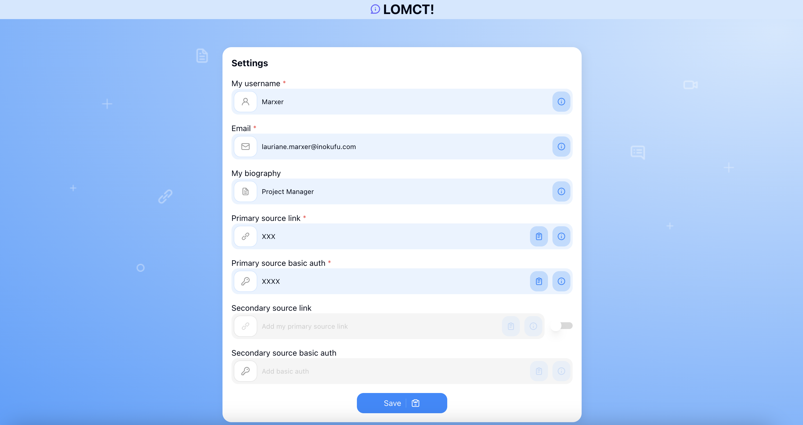

# Learning Object Metadata Crowd Tagging (LOMCT) BB – Design Document

Learning Object Metadata Crowd Tagging is a method for tagging and reviewing digital learning resources such as videos, courses, and documents using a crowd of individuals. The goal is to make these resources more discoverable and searchable by adding relevant keywords, descriptions, reviews and other useful metadata. This process is carried out via the combination of a browser (Chrome) extension and a Learning Record Store (LRS) that allows multiple users to submit review and metadata edit proposal of learning resources. All the reviews and metadata edit proposals are sent in xAPI format and stored in a LRS.

The LOMCT is a data service (browser extension) which facilitates the collection of feedback from teachers, learners, course designers, ... about LO (metadata, reviews). The LO index is a data source (LRS) for organizations which want to store metadata and reviews of LO submitted by their learners, teachers or course designers.

Here is a visual of the LOMCT extension


The LOMCT extension plays a crucial role within the dataspace ecosystem, serving as a vital component that, despite its integral presence, does not engage in direct interaction with the dataspace itself. This design choice highlights the modular nature of the system, where each component has specialized functions. 

For the LOMCT to effectively support its intended use cases, it must collaborate with a Learning Record Store (LRS). The LRS is the custodian of the LOMCT traces that will be shared in the dataspace. This connection from the LRS to the dataspace is established via a Prometheus-X Dataspace Connector (PDC), which ensures secure and efficient data transfer between components.

The primary function of the LOMCT is to generate xAPI traces. These traces are essential for LO discovery and provide valuable information on learning processes. In addition, LOMCT facilitates data exchange, ensuring that relevant information is easily accessible and usable.

However, it is important to note that while the LOMCT is deeply involved in data generation, the actual exchange of data with the data space itself is mediated by the LRS. This underlines the essential role of the LRS in the architecture, as a gateway for the flow of data in and out of the data space, thus maintaining a streamlined and organized data management system.


## Technical usage scenarios & Features

**Key functionalities:**

- Submit metadata edit proposal for a Learning object (LO) by an individual

- Write a review for a LO by an individual

- Visualize all metadata edit proposals and reviews associated to a LO

**Value-added:**

- highlight good learning objects

- better metadata quality of learning objects

- ability to freely review learning object

### Features/main functionalities

**Features**: 

The LOMCT interacts with one or more Learning Records Stores. This LRS is deployed by an organization. Each organization will have its own metadata ecosystem, which can be shared at business model level in the dataspace. Data sent from the LOMCT to the LRS belongs to the organization holding the LRS. This implies :
- The LRS linked to the LOMCT is connected to dataspace via the PDC (the LOMCT is not linked to the PDC).
- The organization gives access to its LRS to the desired individuals.
- Anyone with the LRS “source link” and “source basic auth” can post and view LRS metadata (individual).
- LOMCT does not manage the validation of edit proposals and reviews. Everything is sent to the targeted LRS with no particular status.
- The organization must moderate edit proposals and reviews of its LRS. LOMCT does not offer this service.

The Inokufu organization will offer an additional metadata moderation service.

- **Submit metadata edit proposal of a Learning object (LO) by an individual** \
Each Learning Object (video, article, podcast, …) is described by metadata: title, description, category, type, level, etc. Sometimes the metadata is wrong or missing. With LOMCT, each individual can submit a metadata edit proposal. Once the proposal has been sent, the individual cannot edit it. The only way to modify/delete this metadata is via the LRS, by the LRS holder.\
	Path: \
		- "The individual is confronted with a resource that has few or incorrect metadata" \
		- "The individual opens the LOMCT" \
		- "If the individual does not have an account, he creates one for himself" \
		- "Individual enters the url of the LO to edit" \
		- "The individual submits his metadata edit proposal" \
		- "LOMCT send the metadata edit proposal to the LO index (LRS), formatted as xAPI statement"

- **Write a review of a LO by an individual** \
The same Learning Object can be seen as relevant or not depending on the teacher point of view, his targeted learning outcome, his habits, etc. With LOMCT, each individual can write his own review of the LO and explain why he finds it relevant or not for his needs. Once the review has been sent, the individual cannot edit it. The only way to modify/delete the review is via the LRS by the LRS owner. On the other hand, if the individual sends a new review, this is the one that will be displayed. This does not overwrite the old review, but renders it obsolete. \
	Path:  \
		- "The individual is confronted with a resource that he wants to add a review" \
		- "The individual opens the LOMCT" \
		- "If the individual does not have an account, he creates one for himself." \
		- "Individual enters the url of the LO to add a review" \
		- "The individual submits his review" \
		- "LOMCT send the review to the LO index (LRS), formatted as xAPI statement"

- **Visualize all metadata edit proposals and reviews associated to a LO** \
Thanks to LOMCT, many metadata edit proposals and reviews will be collected for each LO. All these data are stored as xAPI statements in a LRS. With LOMCT, each individual can see all the metadata edit proposals and reviews associated with a LO, made by all others individuals connected to the same LRS.  \
	Path:  \
		- "The individual opens the LOMCT" \
		- "Individual enters the url of the LO to visualize" \
		- "LOMCT send request to LO index (LRS)" \
		- "LOMCT display informations, metadata edit proposals and reviews linked to this LO" \

### Technical usage scenarios

Here is an example of how LOMCT is used by an university professor:

- A university professor is preparing a course on the history of medieval Europe. They have created a number of digital learning resources, including video and documents, to support the course.

- The professor wants to make these resources more discoverable and searchable for students, so they decide to use LOMCT to add them to the university LO index (LRS) with relevant metadata.

- The professor uses an LMS that allows multiple users to contribute and edit a given course.

- Others course contributors use the LOMCT to write reviews about some of the learning objects used in this courses

- The university LO index is connected to a service that uses machine learning algorithms to automatically improve metadata quality of the LO and compute quality indicators for each LO based on the reviews provided by the contributors.

- If the university is connected to other partner universities through the data space of education and skills, the professor can make the metadata of its LO available to other users in the partner universities. This will allow other organizations and individuals to discover and access the learning objects using the relevant keywords and descriptions provided.

Here is an example of how LOMCT is used by an employee of company:

- An employee of a pharmaceutical company would like to consolidate his knowledge of natural medicines.

- The employee searches YouTube for a video on the subject.

- He finds a video interesting and would like to hear what other people think.

- He opens LOMCT, looks at the comments and realizes that the resource is rated 4 out of 5 stars with 42 reviews. The overall opinion is that the resource is for beginners.

- Then he goes to the information tab in the LOMCT where he sees that the resource is rated as "expert".

- He proposes changing this metadata to "novice". This way, people looking for an easy resource will find this video.

## Requirements

| Requirement ID | Short description | BB input format | BB output format | Any other constraints | Verified by scenario | Requirement type |
|---|---|---|---|---|---|---|
| BB-REQ_ID__1 | LOMCT must request the consent of collect data | | |  |  |  |
| BB-REQ_ID__1.1 | Individuals must consent to the use of their data in LOMCT : mail, username and biography| chek box | chek box | If the answer is no, the user has no access to the extension | BB-SC-LOMCT-01 | DEP |
| BB-REQ_ID__2 | LOMCT must be connected to an LRS | credential of LRS | |  |  |  |
| BB-REQ_ID__2.1 | The organization's LRS must be connected to the dataspace to access the orchestrator's LRS | PDC | PDC |  |BB-SC-LOMCT-02 | DEP |
| BB-REQ_ID__2.2 | LOMCT must send traces to organization's LRS in less than 30 seconds (after triggering the individual) | xAPI | xAPI |  | BB-SC-LOMCT-03| PERF |

## Integrations

### Direct Integrations with Other BBs

**Interact with LRS**

How?

- credentials of LRS in the LOMCT : source link and source basic auth

- synchronous

- xAPI format

Why?

- The LRS is the custodian of the LOMCT traces that will be shared in the dataspace.


## Relevant Standards

### Data Format Standards

**Data format:**

- The data produced and/or consumed are learning records. These are logs of learning activity done by a user.

- There are several standard formats for learning records (SCORM, xAPI, cmi5, IMS caliper).

- The consensus among experts is that xAPI is the most promising standard for describing learning records.

- Inokufu have published on Prometheus-X's github a state of the art study about learning records interoperability in 2023 (see [here](https://github.com/Prometheus-X-association/learning-records-interoperability-2023)). This study describes the various formats and explains why “we" have selected xAPI as the defacto format for learning records for DASES (Dataspace of Education & Skills).

- In xAPI, each learning record is a json statement. This json contains several parts: actor, verb, object, result, context, timestamp.

- For reviews, data will be in xAPI format with the verb “http://id.tincanapi.com/verb/reviewed”.

- For metadata edit proposal, data will be in xAPI format with the verb “https://w3id.org/xapi/dod-isd/verbs/proposed”.

### Mapping to Data Space Reference Architecture Models


PDC : Prometheus-X Dataspace Connector

Each organization will generate metadata in its LRS, then send it to the LRS orchestrator for exchange in dataspace.

## Input / Output Data

Input and output data are in the same format: xAPI.
For reviews, data will be in xAPI format with the verb “http://id.tincanapi.com/verb/reviewed”.
For metadata edit proposal, data will be in xAPI format with the verb “https://w3id.org/xapi/dod-isd/verbs/proposed”.

As LOMCT is not an API, no BB other than LRS will need to send or receive data.

**Example 1: Review**

An individual, Martin Dupont, teacher (lauriane.marxer+LOMCT@inokufu.com) want to write a review about this video:

 [https://www.youtube.com/watch?v=RFXGpG7agA0](https://www.youtube.com/watch?v=RFXGpG7agA0)

His review is:

- he rates this video 4.5/5

- he writes the following comment: “This Moodle plugin looks very interesting.”

Here is the corresponding xAPI statement:


```json
{
  "stored": "2024-12-04T08:25:06.571Z",
  "priority": "MEDIUM",
  "active": true,
  "client": "XXX",
  "lrs_id": "XXX",
  "activities": [
    "https://www.youtube.com/watch?v=RFXGpG7agA0"
  ],
  "agents": [
    "mailto:lauriane.marxer+lomct@inokufu.com"
  ],
  "statement": {
    "authority": {
      "objectType": "Agent",
      "name": "Mockup LOMCT all",
      "mbox": "mailto:contact@inokufu.com"
    },
    "stored": "2024-12-04T08:25:06.571Z",
    "context": {
      "extensions": {
        "http://schema.prometheus-x.org/extension/username": "Martin Dupont",
        "http://schema.prometheus-x.org/extension/biography": "Teacher "
      },
      "language": "en"
    },
    "actor": {
      "objectType": "Agent",
      "name": "Martin Dupont",
      "mbox": "mailto:lauriane.marxer+lomct@inokufu.com"
    },
    "timestamp": "2024-12-04T08:25:06.571Z",
    "version": "1.0.0",
    "id": "XXX",
    "result": {
      "score": {
        "raw": 4.5                  // Representing a 4.5/5 score
      },
      "response": "This Moodle plugin looks very interesting."
    },
    "verb": {
      "id": "http://id.tincanapi.com/verb/reviewed",
      "display": {
        "en-US": "reviewed"
      }
    },
    "object": {
      "id": "https://www.youtube.com/watch?v=RFXGpG7agA0",
      "objectType": "Activity"
    }
  },
  "verbs": [
    "http://id.tincanapi.com/verb/reviewed"
  ],
  "timestamp": "2024-12-04T08:25:06.571Z",
  "relatedActivities": [
    "https://www.youtube.com/watch?v=RFXGpG7agA0"
  ],
  "relatedAgents": [
    "mailto:lauriane.marxer+lomct@inokufu.com",
    "mailto:contact@inokufu.com"
  ],
}
```

**Example 2: Metadata Edit Proposal**

An individual, Martin Dupont, teacher (lauriane.marxer+LOMCT@inokufu.com) want to propose metadata edit about this video: 

 [https://www.youtube.com/watch?v=hLE-5ElGlPM](https://www.youtube.com/watch?v=hLE-5ElGlPM)

His proposals are:

- this video is associated to the verb discover according to bloom taxonomy

- the provider of this video is Youtube

Here is the corresponding xAPI statement:


```json

{
  "stored": "2024-12-04T08:25:06.571Z",
  "priority": "MEDIUM",
  "active": true,
  "client": "XXX",
  "lrs_id": "XXX",
  "activities": [
    "https://www.youtube.com/watch?v=hLE-5ElGlPM"
  ],
  "agents": [
    "mailto:lauriane.marxer+lomct@inokufu.com"
  ],
  "statement": {
    "authority": {
      "objectType": "Agent",
      "name": "Mockup LOMCT all",
      "mbox": "mailto:contact@inokufu.com"
    },
    "stored": "2024-12-04T08:25:06.571Z",
    "context": {
      "extensions": {
        "http://schema.prometheus-x.org/extension/username": "Martin Dupont",
        "http://schema.prometheus-x.org/extension/biography": "Teacher ",
	"http://id.tincanapi.com/extension/bloom": "discover",
	"http://id.tincanapi.com/extension/provider": "YouTube"
      },
      "language": "en"
    },
    "actor": {
      "objectType": "Agent",
      "name": "Martin Dupont",
      "mbox": "mailto:lauriane.marxer+lomct@inokufu.com"
    },
    "timestamp": "2024-12-04T08:25:06.571Z",
    "version": "1.0.0",
    "id": "XXX",
    "verb": {
      "id": "https://w3id.org/xapi/dod-isd/verbs/proposed",
      "display": {
        "en-US": "proposed"
      }
    },
    "object": {
      "id": "https://www.youtube.com/watch?v=hLE-5ElGlPM",
      "objectType": "Activity"
    }
  },
  "verbs": [
    "https://w3id.org/xapi/dod-isd/verbs/proposed"
  ],
  "timestamp": "2024-12-04T08:25:06.571Z",
  "relatedActivities": [
    "https://www.youtube.com/watch?v=hLE-5ElGlPM"
  ],
  "relatedAgents": [
    "mailto:lauriane.marxer+lomct@inokufu.com",
    "mailto:contact@inokufu.com"
  ],
}

```

## Architecture

For the architecture diagrams, we assume that the organization has :
- deployed an LRS with a client and a store for LOMCT
- sent credentials to users: source link and sourc basic auth
- Connected to dataspace via LRS: 
	- integration of the PDC in the LRS
	- all individuals have a Personal Data Intermediary (PDI)
	- contract signed with LOMCT use case
	- all individuals have access to the orchestrator's LRS (extended metadata)


We also assume that individuals have completed the download and account creation process to use LOMCT:
- installed the LOMCT extension
- filled in their mail, username and biography
- filled in the LRS: source and basic auth
- validated the consent check box
- created a PDI
- validated the consent in the PDI
- has access to the orchestrator's LRS

### Dynamic Behaviour

Behavior for displaying LO metadata to the individual in the LOMCT.
Feature : Visualize all metadata edit proposals and reviews associated to a LO :

PDC : Prometheus-X Dataspace Connector

Behavior to edit the metadata of a resource by an individual in the LOMCT.
Features : Submit metadata edit proposal for a Learning object (LO) by an individual and Write a review for a LO by an individual :


## Configuration and deployment settings

**Deployment and installation:**

The organization must :
- deploy an LRS (learning locker for example)

The individual (learner, teacher, ...) must :
- install LOMCT browser extension (available on Chrome first)
  
**Configuration**

The organization must :
- Create a store in LRS
- Create a client associate to the  store in LRS
- Give read and write access to the client
- Send to users : url of xAPI Endpoint and Basic Auth
- Connect the PDC to the LRS
- Sign the contract with the LOMCT offer
- Asks individuals to consent to data exchange from their PDI

The user must :
- create an account by filling in the form :
	- username
	- email
	- biography
	- the URL of xAPI Endpoint received by the organization
	- the basic auth key received by the organization
 - consents to data exchange from its PDI


## Error scenarios defined

The idea of the risk table is to define the probable causes of failure in order to estimate the probability of encountering this failure, to evaluate its secondary effects and therefore to plan preventive or corrective actions.

We will assign 3 scores on a scale of 1 to 10 to potential failures:
- detection (risk of non-detection)
- occurrence (probable occurrence, frequency of occurrence)
- severity of effect (consequences for the customer)

Criticality is calculated as follows:
`criticality = detection x occurrence x severity`

If criticality is greater than 10, then preventive action must be taken. If not, no.
| ID  | Function involved                                                                                     | Description of risk                                             | Effect of failure                                                                                       | Cause of failure                                                                                      | Evaluation - Detection | Evaluation - Occurrence | Evaluation - Severity | Evaluation - Criticality | Preventive actions                                                                                                                                                                    |
| --- | ------------------------------------------------------------------------------------------------------ | --------------------------------------------------------------- | ------------------------------------------------------------------------------------------------------ | ---------------------------------------------------------------------------------------------------- | ---------------------- | ----------------------- | --------------------- | ------------------------ | -------------------------------------------------------------------------------------------------------------------------------------------------------------------------------------- |
| Error-Scenario_1   | **Submit metadata edit proposal and write a review of a Learning object (LO) by an individual** | Data may be lost during migration | The organization doesn't receive the complete statements about the reviews or the metadata edit proposals | Incorrect connection between LOMCT and LRS | 1 | 2 | 4 | 8 | |
|  Error-Scenario_2 || Data could be transmitted to other non-targeted LRSs| Exported data may be accessible to unauthorized persons| They are not properly secured| 6 | 1 | 9 | 54 | Tracing output|                                                                     |
| Error-Scenario_3|| Personal information is sent to LRS without consent| Non-compliance with RGPD| Implementation| 4 | 2 | 9 | 72 | Add a checkbox to consent to the use of personal data in the organization's LRS and require consent in the PDI to share it in the orchestrator's LRS|
| Error-Scenario_4| **Visualize all metadata edit proposals and reviews associated to a LO** | The user proposes a false edition | False metadata | Space for expression | 1 | 3 | 7 | 21 | A unique user id is used to distinguish individuals contributions from the admin statements. The statements of the administrator (owner of the LRS), seen as the truth, are displayed in the “information” area. The statements of the individual (non-LRS owner), unverified, are visible in the “Suggested edits” area|
| Error-Scenario_5 || Metadatas don't update | Poor visualization of the metadata | Slow update due to servers | 1 | 2 | 4 | 8 ||
| Error-Scenario_6  || Inadequate user interface | No use of the platform| UI design is misleading | 4 | 7 | 5 | 140 | Optimize extension, perform quantitative and qualitative tests|
| Error-Scenario_7  || Wrong design choices: colors, shapes, ... | No use of the platform  | UX visual choices such as colors and graphics can subliminally influence the perception of data. Graphs are non-inclusive | 4 | 7 | 5 | 140 |Perform quantitative and qualitative tests|
| Error-Scenario_8  || Identical statements in the same or several LRS | Duplicated information | Several sources of LRS | 1 | 7| 5 | 45 | Organization of LRS data: if they are identical, only 1 should be displayed |
| Error-Scenario_9  || The user is linked to several organizations | Too much information on the front page, information conflict | Implementation | 1 | 7 | 5 | 35 | Only the most recent statement from the primary LRS is visible|
| Error-Scenario_10  || Several reviews from the same individual are detected | Obsolete reviews visible | Implementation | 2 | 5 | 3 | 30 | Display only the most recent review|
| Error-Scenario_11  || Several metadata edit proposal from the same individual are detected | Obsolete metadata visible | Implementation | 2 | 5 | 3 | 30 | All statements are displayed chronologically|  
| Error-Scenario_12 | **Submit metadata edit proposal and write a review of a Learning object (LO) by the organization**    | The organization may decide to change its LRS | Complication in determining the source of truth | Change of LRS  | 1 | 2 | 1 | 2 ||
| Error-Scenario_13 || The organization's statements are not differentiated from individual's statements | Impossible to determine right from wrong (assuming the organization is right)| Implementation| 5 | 5 | 5 | 125 | Detect when actor = authority it is organization|
| Error-Scenario_14  | **Other** | Content Fragmentation| No valorization of statements| The same LO is available on multiple sites and platforms with different URLs | 1 | 7 | 5 | 35 | Assign a Global Unique Identifier (GUID) to each LO|


## Third Party Components & Licenses

External components and licenses:

- chromium-based web browser extension V3, [open source](https://github.com/SimGus/chrome-extension-v3-starter), [license MIT](https://github.com/SimGus/chrome-extension-v3-starter?tab=MIT-1-ov-file#readme)


## OpenAPI Specification

The LOMCT code has no API. In fact, data exchange is generated by the LRS, when an individual submits an edit or review. This data is stored in a third-party LRS, which itself has an API. In our case, we use the LRS learning locker. API calls are generic to all LRSs.

[The OpenAPI specification for an LRS is available here.](https://github.com/Prometheus-X-association/lomct/blob/main/docs/openapi.yml)

## Codebase : Mockup version
To get a functional understanding of this mockup and see some sample traces, go [here](https://github.com/Prometheus-X-association/lomct/blob/main/docs/Mockup%20LOMCT.md).

To have an access to the statements or simply test the extension without deploying LRS on your side, make a request on this document where the source and basc auth of LRS Inokufu are located : https://docs.google.com/document/d/15sV1DR43r0GAP8EV8HmT0b-k0m4glPzQUwgn95XYrSQ/edit

As explained above, the LOMCT code does not include any APIs, so there is no such thing as a dummy code. The only codebase used is that of the LRS with the /PUT /POST and /GET endpoints.

### PUT
description: Store a single statement as a single member of a set.

### POST
description: Store a set of statements (or a single statement as a single member of a set).

### GET
description: Read a single xAPI Statement or multiple xAPI Statements.

[Answer API of Learning Locker](https://learninglocker.atlassian.net/wiki/spaces/DOCS/pages/106463240/Rest+API)

# First version

A first version of LOMCT has been deployed. Its purpose is to validate the functionalities mentioned in this design document. The “dataspace integration” part will be fine-tuned later”. Nevertheless, the principle is the same for this extension.

## Installation

[How to install LOMCT.](https://github.com/Prometheus-X-association/lomct/blob/main/docs/How%20to%20install%20LOMCT.md)
[Ask for an access to the Inokufu's LRS.](https://docs.google.com/document/d/15sV1DR43r0GAP8EV8HmT0b-k0m4glPzQUwgn95XYrSQ/edit?tab=t.0)

## UX/UI

### First Time Onboarding


### Home extension


### Informations

#### More information


#### Metadata edit proposal


### Reviews

#### More reviews


#### Add review


### Options



# Test specification

The Learning Object Metadata Crowd Tagging tests ensure that:
- functionality is efficient
- potential risks are under control
- users are satisfied

## Test reproduction
To reproduce (manual) tests, you need to [install the LOMCT extension](https://github.com/Prometheus-X-association/lomct/blob/main/docs/How%20to%20install%20LOMCT.md).

### Prerequisites
Before installing the LOMCT extension, ensure you have:
- Chrome browser
- A Learning Record Store (LRS) endpoint URL
- A basic auth url for your LRS

### Running instructions
1. Download the latest release
2. Get into developer mode with Chrome extension management
3. Click on `Load Unpacked`
4. Select the `src` folder
5. You can pin the extension (or not)

### Configuration
1. Open the extension and fill in the required fields:
    - username
    - e-mail address
    - biography (this can be your job or profession)
    - endpoint of your LRS
    - basic auth of you LRS
2. Add a secondary source managed by Inokufu (content shared in Prometheus-X and moderated)
    - Navigate to `options` of the extension
    - Activate the secondary source
    - Configure the secondary source link : https://lrs.dataspace.inokufu.com/data/xAPI
    - Configure the secondary source basic auth : NzkxMjlhNzRmNjUyZmI0NmU0NTA5Y2Y5MTdkMmY0ZWU1YjkxYjZkYTo4YWU0MGNhNjJjMmM4NTE4YzZjMzAwZDBhNGI4OTE4YTI0M2I1YjRl 

### Don't have an LRS ?
If you don't have an LRS you can directly add the LRS of Inokufu in the primary source link :
- Configure the primary source link : https://lrs.dataspace.inokufu.com/data/xAPI
- Configure the primary source basic auth : NzkxMjlhNzRmNjUyZmI0NmU0NTA5Y2Y5MTdkMmY0ZWU1YjkxYjZkYTo4YWU0MGNhNjJjMmM4NTE4YzZjMzAwZDBhNGI4OTE4YTI0M2I1YjRl

For the secondary source link you can add this LRS :
- Configure the secondary source link : https://lrs.dataspace.inokufu.com/data/xAPI
- Configure the secondary source basic auth : Njk2NjM2MGVhYzYxYTQxN2MxOGMyMTA0MjgxZmMzYmNkNGMyZmQ2MDpiN2NkNDgyNzdmNjBhMWFjODc3MjEzMWYxNmI3ODU5ZjE5NWI1MTVh

## Test
The LOMCT testing strategy will focus on ensuring the accuracy, reliability, and performance of its functionality. We will use a combination of unit testing, integration testing, and user interface testing. The test environment will reproduce conditions similar to those in production in order to accurately validate BB behavior. Acceptance criteria will be defined based on user stories, functional requirements, and performance criteria.

Summary of test :
- Validate requirements and potential risks
- Testing independent features
- Manual Usage Scenario
- UX/UI test

### Validate requirements and potential risks
Tests to validate requirements and potential risks.

| Verified by scenario| Description | Prerequisites | Test | Status |
|---|---|---|---|---|
| BB-SC-LOMCT-01 | Individuals must consent to the use of their data in LOMCT : mail, username and biography| Browser extension installed but not logged| When creating an account, try to validate the account without validating the check box |  Validated : It is not possible to access metadata without consenting to the sharing of its data |
| BB-SC-LOMCT-02 | The organization's LRS must be connected to the data space to access the orchestrator's LRS |  Browser extension installed and logged, LRS of organization not connected to the PDC and not involved in the use case | Try to access the orchestrator's LRS without the organization's LRS being linked to the dataspace | Not yet validated |
| BB-SC-LOMCT-03 | LOMCT must send traces to organization's LRS in less than 30 seconds (after triggering the individual) |  Browser extension installed and logged, have an access to the LRS of the organization | Average send time < 30 seconds | Not yet validated |
|Error-Scenario_2 | Data could be transmitted to other non-targeted LRSs |  Have an access to the LRS of the organization|See where statements are sent| Validated : Statements are sent only to the target LRS|
|Error-Scenario_3 | Personal information is sent to LRS (other than email) |  Have an access to the LRS of the organization |Check the LRS for visible statements | Validated : No personal information other than the e-mail is sent to LRS|
|Error-Scenario_4 | The user proposes a false edition |  Browser extension installed and logged | Post a proposal edit with fals information and see if it is diplayed in the "information" or in "Suggested edits" section| Validated : It is displayed in the "Suggested edits"|
|Error-Scenario_6 | Inadequate user interface |  Browser extension installed and logged| Conduct quantitative and qualitative tests |Not yet validated|
|Error-Scenario_7 | Wrong design choices: colors, shapes, ... |  Browser extension installed and logged| Conduct quantitative and qualitative tests |Not yet validated|
|Error-Scenario_8 | Identical statements in the same or several LRS |  Browser extension installed and logged| Post the same metadata 2 times and see whether it is displayed 1 or 2 times | Validated only one is visible |
|Error-Scenario_9 | The user is linked to several organizations|  Browser extension installed and logged. Have a primary and a secondary sources linked | See if information from the first source is highlighted | Validated : Primary source information is highlighted|
|Error-Scenario_10 | Several reviews from the same individual are detected |  Browser extension installed and logged |Post 2 reviews and see whether it is displayed 1 or 2 times |  Validated : display one time (most recent)|
|Error-Scenario_11 | Several metadata edit proposal from the same individual are detected |  Browser extension installed and logged |Post 2 metadata editing proposals and see if they are both displayed (chronologically) |  Validated : The 2 are displayed chronologically|
|Error-Scenario_13 | The organization's statements are not differentiated from individual's statements|  Browser extension installed and logged. Have access to the LRS of the organization| Manually post an organization statement in the LRS with the verb “proposed” associated with an LO, then check in the LOMCT that this statement is visible in the “information” section | Validated : The statement is display in the "information" section|
|Error-Scenario_19 | Content Fragmentation |  Browser extension installed and logged. Have access to the LRS of the organization|Check if the statements are the same if the endpoints of the same url are different| Partially validated : Ok for canonical urls|

### Testing independent features

Small manual test to prove features (button, ...)

#### Test Case 1: Verify Logo Icon
Objective: Ensure the extension logo matches the specified icon and color. 

Precondition: The extension is installed and enabled. 

Steps:
- Open Google Chrome.
- Locate the extension icon in the toolbar.
- Verify the icon matches https://www.iconfinder.com/icons/8725689/comment_info_icon.
- Verify the icon color is #1F8AFF.
  
Expected Result: The extension logo icon and color match the specified design.

Result: Validated.

#### Test Case 2: Verify Extension Display on Click
Objective: Ensure the extension is displayed when the logo is clicked. 

Precondition: The extension is installed and enabled.

Steps:
- Open Google Chrome.
- Click on the extension logo.

Expected Result: The extension popup is displayed as a 300 px square on top of the page.

Result: Validated.

#### Test Case 3: Verify Extension Removal on Click
Objective: Ensure the extension is hidden when the logo is clicked again.

Precondition: The extension popup is displayed.

Steps:
- Click on the extension logo again.

Expected Result: The extension popup is hidden.

Result: Validated.


...

#### In conclusion, all the small functional tests are validated.
[Here you will find detailed tests.](https://github.com/Prometheus-X-association/lomct/blob/main/docs/Test%20case.md)


### Manual Usage Scenario

Using the personas, user stories, user flow, and data flow from the Wiki LOM use case, we established several test scenarios.

#### Persona 1: mmegauss (1 LRS)
First time install with 1 LRS
- Onboarding:
  - Enter username: "mmegauss"
  - Write bio: "Professeur de linguistique au M2 Sciences Po Paris"
  - Connect the primary source link : https://lrs.dataspace.inokufu.com/data/xAPI
  - Configure the secondary source basic auth : NzkxMjlhNzRmNjUyZmI0NmU0NTA5Y2Y5MTdkMmY0ZWU1YjkxYjZkYTo4YWU0MGNhNjJjMmM4NTE4YzZjMzAwZDBhNGI4OTE4YTI0M2I1YjRl 
  - Accept the checkbox for visibility of username and biography.

Validation:
- Account creation with locally stored information.

#### Persona 2: mcgonagall (2 LRS)
First time install with 2 LRSs
- Onboarding:
  - Enter username: "mcgonagall"
  - Write bio: "Management professor at Cambridge University"
  - Connect the primary source link : https://lrs.dataspace.inokufu.com/data/xAPI
  - Configure the primary source basic auth : NzkxMjlhNzRmNjUyZmI0NmU0NTA5Y2Y5MTdkMmY0ZWU1YjkxYjZkYTo4YWU0MGNhNjJjMmM4NTE4YzZjMzAwZDBhNGI4OTE4YTI0M2I1YjRl 
  - Accept the checkbox for visibility of username and biography.
  - Continue to settings extension page.
  - Connect the secondary source link : https://lrs.dataspace.inokufu.com/data/xAPI
  - Configure the secondary source basic auth : Njk2NjM2MGVhYzYxYTQxN2MxOGMyMTA0MjgxZmMzYmNkNGMyZmQ2MDpiN2NkNDgyNzdmNjBhMWFjODc3MjEzMWYxNmI3ODU5ZjE5NWI1MTVh

Validation:
- Account creation with locally stored information.

#### Persona 3: the authority of LRS: "https://lrs.dataspace.inokufu.com/data/xAPIx"

#### Test scenario 1

mmegauss (persona 1) writes a review:
- Learning Object: [https://www.youtube.com/watch?v=hLE-5ElGlPM](https://www.youtube.com/watch?v=hLE-5ElGlPM)
- Review:
  - Rating: 5/5
  - Comment: “Fantastic video for every history student in the Bachelor of Medieval History.”
  
Validation:
- Statement visible on connected LRS.
- Review displayed in the reviews section.

Test scenario 1 : Validated

#### Test scenario 2

mcgonagall (persona 2) writes a review:
- Learning Object: [https://www.youtube.com/watch?v=daM8YfBTNAg](https://www.youtube.com/watch?v=daM8YfBTNAg)
- Review:
  - Rating: 4/5
  - Comment: “Good podcast to understand the Second World War.”

Validation:
- Statement visible on both connected LRSs.
- Review displayed only once in the reviews list.

Test scenario 2 : Validated

#### Test scenario 3

mmegauss (persona 1) submits a metadata edit proposal:
- Learning Object: [https://www.youtube.com/watch?v=daM8YfBTNAg](https://www.youtube.com/watch?v=daM8YfBTNAg)
- Proposal:
  - Change type to podcast.
  - Title: History through time
  - License: [https://www.gnu.org/licenses/quick-guide-gplv3.en.html](https://www.gnu.org/licenses/quick-guide-gplv3.en.html)
  - Provider: Youtube

Validation:
- Proposal visible on LRS.
- Displayed in "Suggested Edits" section in the "information" extension.

Test scenario 3 : Validated

#### Test scenario 4

mcgonagall (persona 2) submits a metadata proposal:
- Learning Object: [Quelle différence entre l'anglais américain et britannique ? Quel accent choisir : UK ou US ?](https://www.youtube.com/watch?v=GXaPlHQQvlg)
- Proposal:
  - Type: Video
  - Bloom: understand
  - Title: Quelle différence entre l'anglais américain et britannique ? Quel accent choisir : UK ou US ?
  - Provider: Youtube
  - Language: French
  - Keywords: 'BritishVsAmerican'

Validation:
- Proposal visible on both connected LRSs.
- Displayed only once in "Suggested Edits" section.

Test scenario 4 : Validated

#### Test scenario 5

The authority (Persona 3) posts metadata edit directly in the LRS:
- Learning Object: What caused the French Revolution? - Tom Mullaney
- Posts 2 statements:
  1.On March 5 
     - Type: Podcast
     - Bloom: describe compare
     - Level: expert
     - Title: History through time
     - License: [https://www.gnu.org/licenses/quick-guide-gplv3.en.html](https://www.gnu.org/licenses/quick-guide-gplv3.en.html)
     - Provider: Youtube
     - Language: English
     - Duration: 5:38 minutes
     - Author: Tom Mullaney

  2. On March 2 
     - Type: Video
     - Title: what caused the French Revolution?
     - Level: novice
     - Provider: Youtube
     - Language: English

Validation:
- Statements visible on authority's LRS.
- Only the statement published on March 5 displayed in "information" section.

Test scenario 5 : Validated

#### Test scenario 6

mmegauss (persona 1) writes 2 reviews on the same learning object:
- Learning Object: [Langage Langue Parole (selon De Saussure) - Ma Langue dans Ta Poche #1](https://www.youtube.com/watch?v=Y3EoAizjvtc)
- Previous review:
  - Date: 07-12-2017
  - Rating: 3/5
  - Comment: “La vidéo n'est pas pertinente par rapport à l'ouvrage de l'auteur.”
- Subsequent review:
  - Date: 04-05-2020
  - Rating: 4/5
  - Comment: “C'est une vidéo dynamique pour introduire la pensée de Saussure aux étudiants de licence.”

Validation:
- Both statements visible on LRS.
- Only the newest review displayed in reviews list.

Test scenario 6 : Validated

#### Test scenario 7

mcgonagall (persona 2) writes 2 reviews on the same learning object:
- Learning Object: [https://hbr.org/2016/05/embracing-agile](https://hbr.org/2016/05/embracing-agile)
- Previous review:
  - Date: 01-04-2022
  - Rating: 5/5
  - Comment: “Interesting Article for Educational Use with First-Year College Students”
- Subsequent review:
  - Date: 06-07-2023
  - Rating: 4/5
  - Comment: “The article is still useful, but it needs an update.”

Validation:
- All statements visible on both connected LRSs.
- Only the newest review displayed in the reviews list.

Test scenario 7 : Validated

#### Test scenario 8

mmegauss (persona 1) submits several metadata edit proposals:
- Learning Object: [https://en.wikipedia.org/wiki/President_of_the_United_States](https://en.wikipedia.org/wiki/President_of_the_United_States)
- Proposals:
  1. Change type to podcast.
     - Title: President
     - Provider: Youtube

  2. Type: article
     - Title: President of the united States
     - Provider: Wikipedia

Validation:
- Both statements visible on LRS.
- Displayed statements in "Suggested edits" section chronologically.

Test scenario 8 : Validated


### UX/UI test 
Conduct quantitative and qualitative tests to validate the extension's visuals.
We will conduct interviews and [“Attrakdiff” questionnaires.](https://www.attrakdiff.de/index-en.html)

## Partners & roles
[Inokufu](https://www.inokufu.com/) (BB leader): 
- Organize workshops
- Monitor partner progress
- Develop backend of LOMCT
- Develop frontend of LOMCT

[edtake](https://www.edtake.com/)
- test the extension

## Usage in the dataspace
The LOMCT will be used as a potential source of data for a LRS and thus be part of the service chains:

- Personal learning record: Sharing LMS/Moodle Data for Visualization

  
.png)
PDC : Prometheus-X Dataspace Connector

- Decentralized AI training: Training of trustworthy AI models
